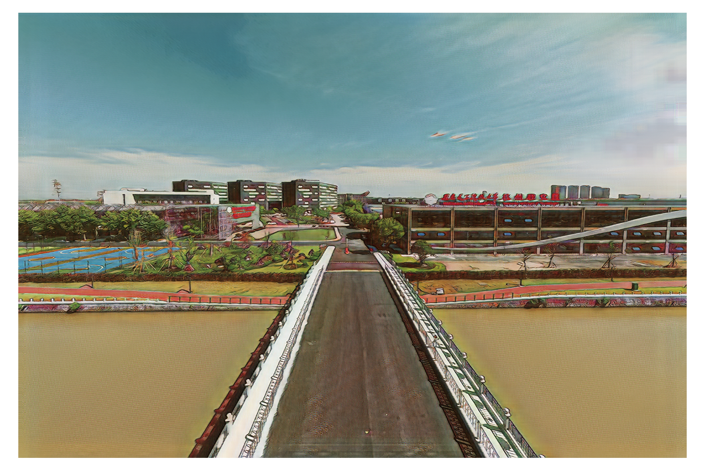
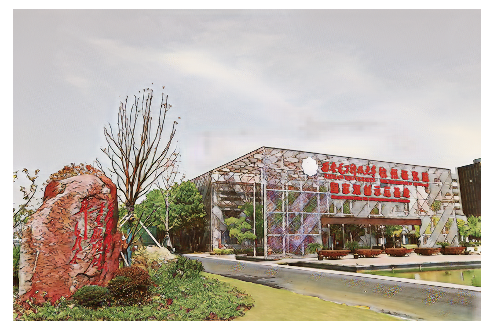

# 西电杭州研究院AI明信片

献礼西电90周年校庆，采用人工智能相关技术制作的以杭州研究院为主题的明信片。

## 所用技术
- NST风格迁移
- GANILLA网络（<https://arxiv.org/abs/2002.05638>）
- 手写字生成网络（<https://github.com/EuphoriaYan/zi2zi-pytorch>）
- 语音合成
- Web技术

## 卡片展示

### 总景观

<http://static.dowdyboy.com/html_mingxinpian/zjg.html>

### 科研楼

<http://static.dowdyboy.com/html_mingxinpian/kyl.html>

### 综合楼

<http://static.dowdyboy.com/html_mingxinpian/zhl.html>

### 图书馆

<http://static.dowdyboy.com/html_mingxinpian/tsg.html>

### 餐厅

<http://static.dowdyboy.com/html_mingxinpian/st.html>

### 健身房

<http://static.dowdyboy.com/html_mingxinpian/jsf.html>

### 操场

<http://static.dowdyboy.com/html_mingxinpian/cc.html>

### 口袋公园

<http://static.dowdyboy.com/html_mingxinpian/kdgy.html>

